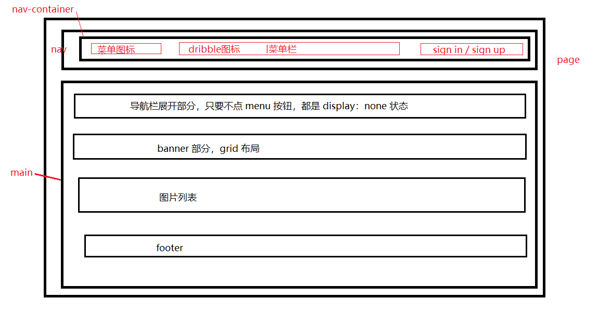

#### 实现思路：

##### 1.html



##### 2.css

###### 2.1 导航栏的布局方式：

导航栏采用的是 flex 布局方式，水平设置 space-between，竖直方向设置 center。

###### 2.2 菜单按钮的实现

采用一个盒子包裹两张图片，在界面宽度小于 920px 时，正常显示，当超过该值时，设置 display：none。

###### 2.3 dribble图标和菜单平铺在导航栏、sign in/up的实现

实现方式和菜单按钮方式类似，在宽度小于 920px 时，设置菜单内容和 sign up内容 display：none。

###### 2.4 导航栏展开部分内容实现

导航栏展开部分内容总体采用 ul 标签实现，默认是放在 main 里面但是不显示的，当点击menu按钮的时候，占据 main 的全部。

###### 2.5 banner 部分的实现

采用 grid 布局的方式，设置 justify-items 和 align-items 为 center，使图片和文字部分在各自的单元格内居中。

文字部分内容的总体采用 flex布局的方式 ，flex 的 direction  为 column，给该盒子设置 text-align：center 的方式，实现它内部文字居中显示的效果。

当界面宽度超过 768px 时，设置 grid 的 布局方式为 1 行两列，同时设置 direction：rtl，从左到右排列的方式，实现文字在左，图片在右。此时，设置 text-align 为 end，实现文字左边对齐（因为设置direction：rtl，因此不能用 start）。

###### 2.6 图片列表的实现

使用 ul 标签进行实现，设置布局方式为 grid 布局，根据不同窗口大小，直接调整 grid-template-columns 布局方式即可实现。

###### 2.7 footer实现

采用 flex 布局，排列方式为竖向排列

##### 3.js

###### 3.1 load 函数

加载数据

###### 3.2 createList 函数

创建代码片段，将所有的图片项都先插入到其中，最后在将他插入到父节点 ul 中。

对于每一个图片项，使用 拼接字符串配合 innerHtml 使用，字符串模板如下：

```html
`<div class="picture-cover">
    
 </div>
 <div class="picture-msg">
     <div class="user-info">
         
         <span class="user-name">${item.name}</span>
         <span class="user-badge">${item.badge}</span>
     </div>
	 <div class="like-and-view">
         
         ${item.likes}
         
         ${item.views}
      </div>
 </div>`
```

同时需要注意的是，数据项 badge 字段存在值为空的情况，但是设置的样式中存在 padding：2px 3px，因此该部分内容会显示在页面上，造成样式设置出错。

解决方式，在使用每一个数据进行渲染的时候，记录badge 字段值为空的数据下标，将其存放到数组 pos 中，然后获取到所有该字段的 dom 元素，将 pos 中对应的下标的 dom 元素的样式设置为 display：none。

###### 3.3 collapse 函数

对 导航部分的两张照片 menu 和 close 分别绑定点击事件，实现页面的切换功能。

需要注意的是，会有这样一种情况，在界面宽度较小的时候，点击menu 出现展开菜单界面，此时调大窗口，会消失导航部分，但是在调小会原尺寸的时候，显示的还是 menu 展开的界面。

解决方法：使用 resize 监听界面大小，屏幕超过 920px 的时候，不显示相关内容，当尺寸小于 920px，判断此时导航栏两个图标状态（是否为 none），进而来确定显示的是哪一个界面。